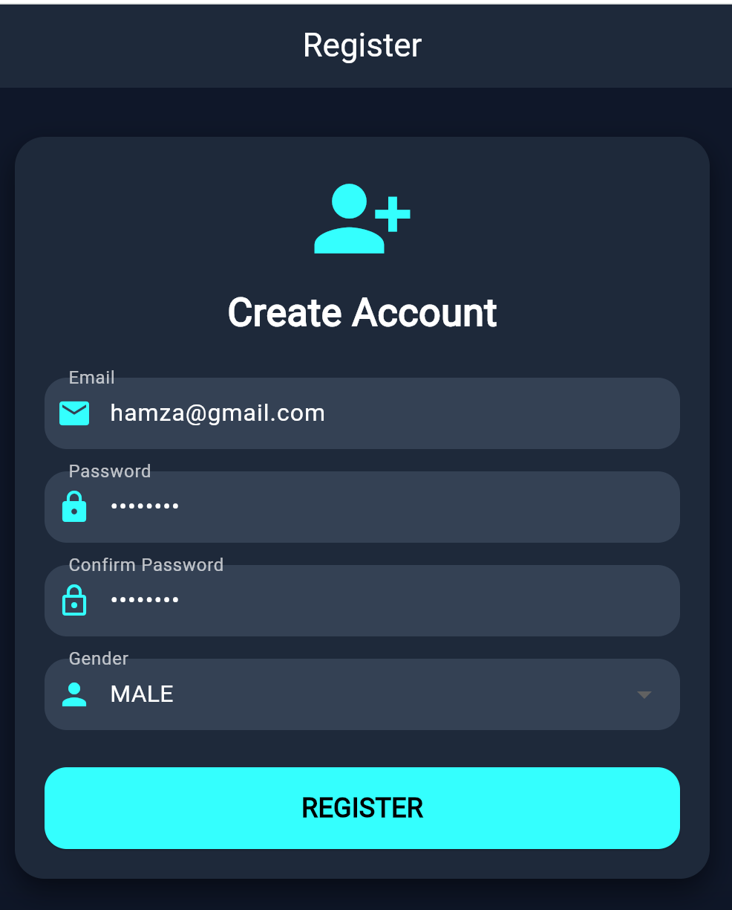
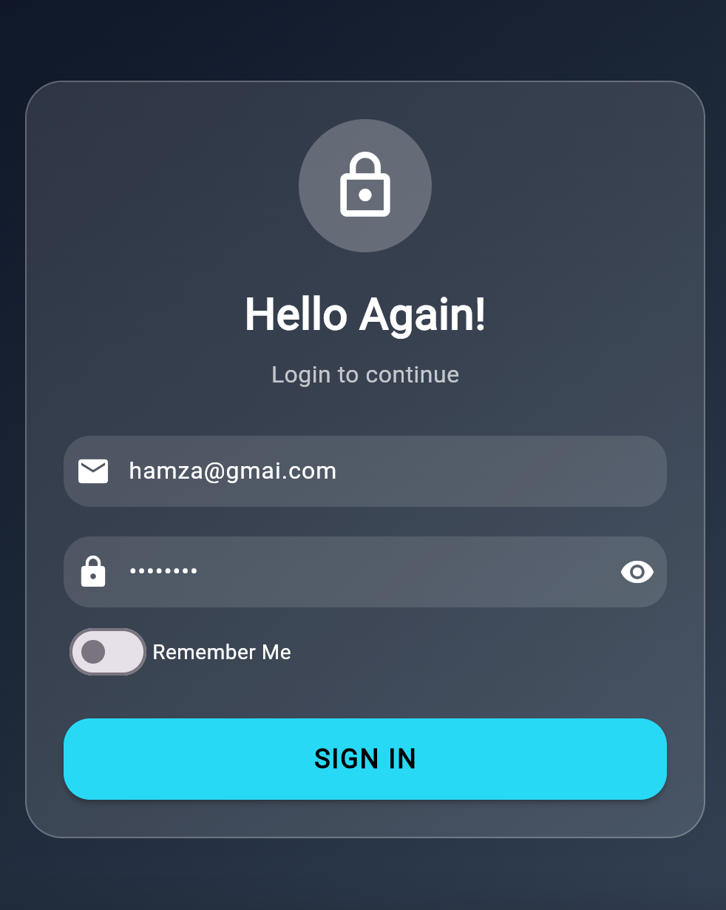
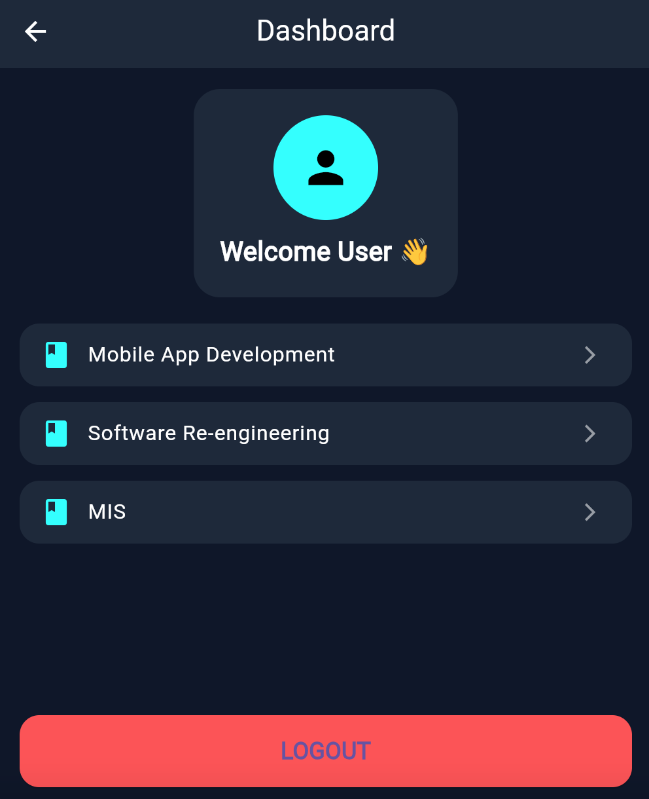

# assignment

# Flutter Multi-Screen Application Development

## Student Information

| Field | Details |
|-------|---------|
| **Student Name** | Muhammad Hamza Tariq |
| **Student ID** | *(Add your Student ID here)* |
| **Course** | Mobile Application Development |
| **Course Code** | SE-4308-CS-252-BS-SE-8A |
| **University** | DHA Suffa University |
| **Semester** | Spring 2026 |
| **Due Date** | Tuesday, 12 May 2026 |

---

## Project Description

This is a modern Flutter-based Academic Management App designed for students to manage and view their academic subjects in a clean and structured interface. The application includes authentication, dashboard, and detailed subject views with a premium dark UI design.

The project is built using Flutter with Provider for state management and follows a modular and scalable architecture.

---

## Core Features Implemented

- ✅ Form Validation (Email, Password, Empty fields)
- ✅ Custom Validator Class (reusable, separate from UI)
- ✅ Enum Implementation (Gender, Auth State)
- ✅ Controller Layer Architecture
- ✅ Multi-screen Navigation
- ✅ Password show/hide toggle
- ✅ Remember Me functionality

---
## Screenshots

### 1. Register Screen

### 2. Login Screen

### 3. Dashboard Screen
